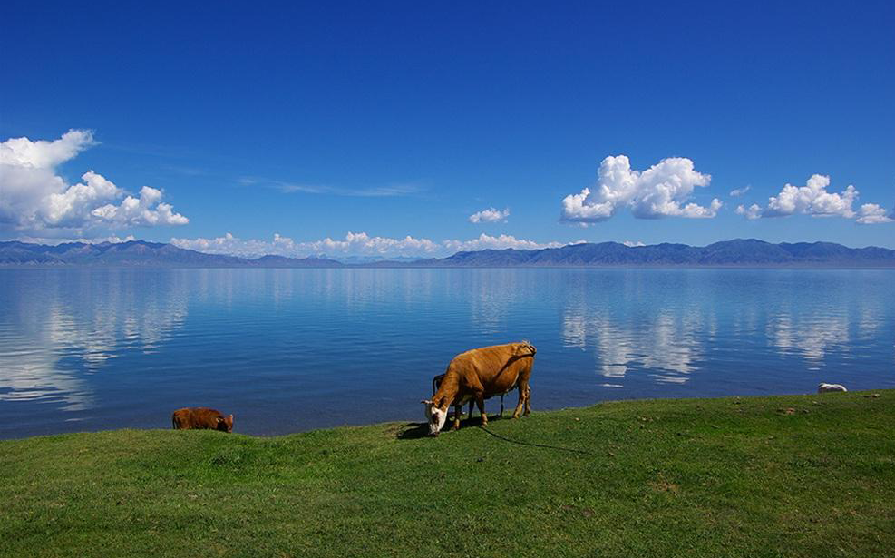
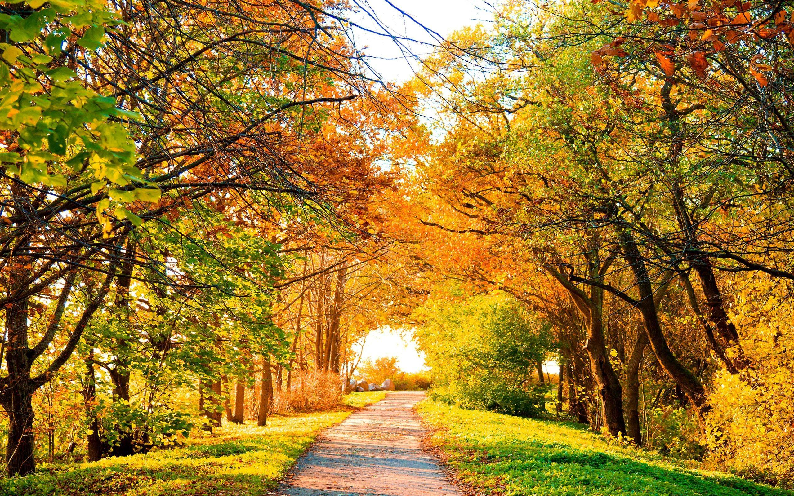

# 主色调
每张照片都有若干个主色调。但是色调的个数并不唯一。一般情况下，每张图片的主色调可以有2个、4个、8个、16个等。主色调的获取可以利用Photoshop，步骤也很简单。

# 利用
如果你在搞家庭装修，正在为家里的装饰颜色发愁。不妨借助一下大自然的灵性。你可以从网络上搜索一些你心仪的图片。譬如你可以搜索“风景 安静”的图片，或者是“风景 愉悦”的图片。从中选择一张或几张你中意的。而后把它们用Photoshop打开，导出为PNG8格式图片，并从颜色数量上选出你能把握的。比如2位、4位或8位等。我比较喜欢中庸的8位。

# 效果
你可以从主色调中选出一些来对家庭环境进行装饰。比如安静的主色调中，你可以选择天蓝色作为屋顶或者墙壁的颜色，并把地板的颜色设定为草绿色。这样得到的效果就和大自然保持了一致，并可以自然地体会到安静、安逸。愉悦的图片道理是一样的。
后期，我会给出用主色调进行装饰的效果图。敬请期待！
