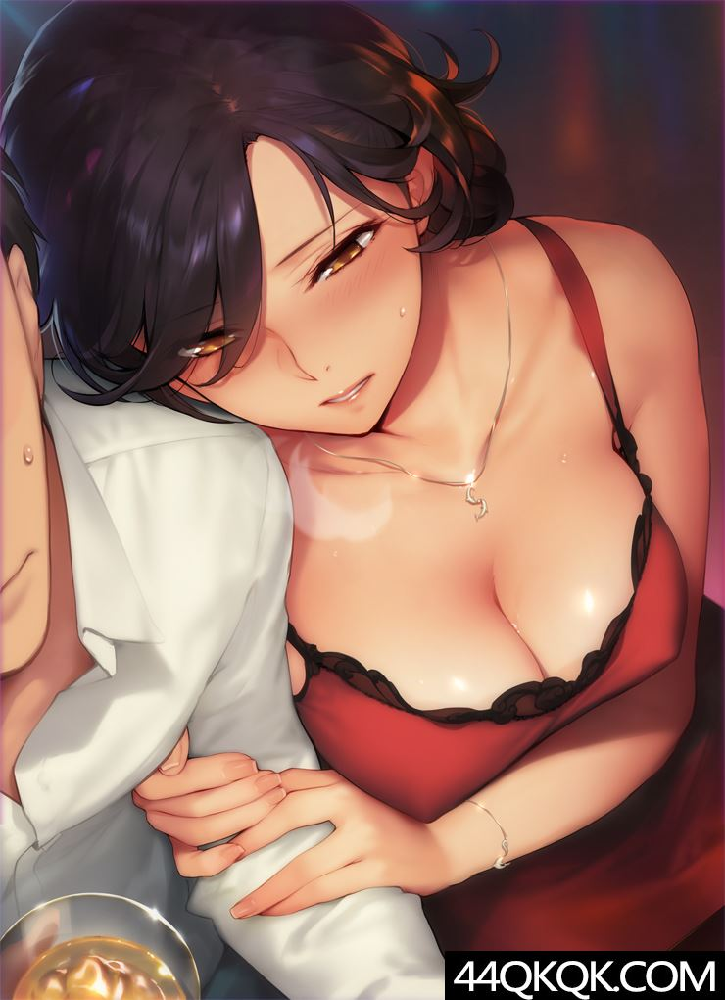

# 性

我想我的婚姻并不是很令我愉悦的。先说说我骨子里的追求吧。我打小就是个颜色动物，对各种稀奇古怪的颜色很敏感。尤其是温情色系的过渡，简直让我如痴如醉。记得小时候在姥爷家里看到了一张时髦女郎的美颜宣传画，经不能自拔地上去亲吻。当时还被我弟弟发现了，竟然纵容着他要挟我。

我能理解自己的这种早熟般的色。小时候没有过多的自知和自识，迷糊中认为这些都有原罪，需要偷偷地来，不能被别人发现了。现在有了一些认识和长进，大致能明白这些都是身体内化学元素之间的作用导致的。所以，对于羞涩，我基本上就丢弃了。

但是，无论小时候自己的自慰还是成人后和爱人的性交，满足后，身体上都是一种无法用言语描述的满足感。我的整个身体都是安详的，尤其是腰部，一点儿都没有酸痛的感觉。更多的是舒服和惬意。

# 婚姻

我的婚姻起始于大学期间，一位高中女同学给我的一次暗示。她说要给我介绍个女朋友，其实是她想和我好。我被从女人的煎熬现状到突然有了个女人的转变中，只体会到了冲动和心跳，完全没有注意到这位潜在爱者的柔弱的心。我欣然接受了。可能当时就谋划着自己如何和整个未来的女子进行的性交吧。我很迫不及待。
